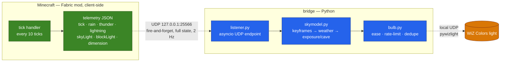

# Minecraft Sky Sync

Mirrors the Minecraft (Java Edition) sky onto a WiZ Colors smart light in real
time. Daylight cycle, weather, cave lighting, and dimension all drive the
light's colour and brightness directly, so a dark room tracks whatever is
happening in the game.

A Fabric mod reads game state on the client each tick and sends it over
local UDP to a small Python process, which resolves it into a colour and
brightness and drives the light over pywizlight. Everything client-side,
works in singleplayer and on any server.

## Architecture



Two independent processes joined by one UDP socket. The mod does no
modelling of its own — it just reports raw state every tick — so every
colour, brightness curve, and easing constant lives in the bridge and can
be retuned without touching Minecraft.

## Features

- Daylight cycle drives light colour and brightness off the actual game
  tick, not a wall-clock timer.
- Rain and thunder desaturate and dim the sky; lightning strikes flash the
  light.
- Sky exposure blends toward torchlight under a roof or underground, and
  goes fully dark in an unlit cave — no special-casing needed, it falls
  out of the same blend used for doorways and cave mouths.
- Nether and End get fixed, non-cycling moods.
- Full day cycle can be replayed in ~30 seconds (`--simulate`) for fast
  colour and brightness tuning without waiting through a real 20-minute day.

## Requirements

- JDK 21
- Python 3.11 or newer
- A WiZ Colors light, reachable on the same local network, with **local
  control enabled** in the WiZ app (Settings on the device → local/LAN
  control). Without this the light answers reads but silently rejects every
  write.
- 2.4 GHz Wi-Fi for the machine running the bridge — WiZ's local UDP
  discovery does not cross bands on most routers.

## Setup

**1. Pair and locate the light.** Pair it in the WiZ app over 2.4 GHz, then
confirm it answers locally:

```bash
pip install pywizlight
python -m pywizlight.cli discover -b <your-subnet-broadcast, e.g. 192.168.0.255>
```

Note the IP it reports. A DHCP reservation for it in your router is worth
setting up — nothing here re-discovers the light automatically if its IP
changes.

**2. Build the mod.**

```bash
cd mod
./gradlew build
```

First run downloads and decompiles Minecraft; expect several minutes.
Subsequent builds are fast.

**3. Set up the bridge.**

```bash
cd bridge
python -m venv .venv
.venv\Scripts\pip install pywizlight pytest pytest-asyncio
```

Then open `bridge/config.py` and set `BULB_IP` to the address from step 1.

**4. Verify.**

```bash
cd bridge
.venv\Scripts\python.exe -m pytest tests/
```

Should all pass with no light or Minecraft involved — `skymodel.py` and
`bulb.py` are both pure/mockable and covered independently of the network.

## Running it

Two things need to be running at once. Order doesn't matter, but nothing
happens on the light until both are up.

**The bridge**, from `bridge/`:

```bash
.venv\Scripts\python.exe main.py
```

Leave this running in its own terminal. Ctrl+C to stop it.

**The Minecraft client**, from `mod/`:

```bash
./gradlew runClient
```

This opens a self-contained Fabric dev client with the mod loaded — not
your regular Minecraft install. Load or create a singleplayer world; the
mod stays silent at the title screen by design. Once you're in a world the
light should start tracking the sky within a couple of seconds.

There's no packaged, double-click-to-play build yet — see Status below.

### Tuning fast, without Minecraft

```bash
cd bridge
.venv\Scripts\python.exe main.py --simulate            # drives the real light
.venv\Scripts\python.exe main.py --simulate --no-bulb  # prints instead of sending
```

## Configuration

All calibration lives in `bridge/config.py`: brightness envelope
(`RAW_MIN`/`RAW_MAX`/`FLASH_MAX`), update rate, easing, and how much of a
colour's white component gets mixed into the light's white LEDs
(`WHITE_MIX`, default 0 — pure colour, no dilution). Keyframe colours and
the weather/exposure blend live in `bridge/skymodel.py`. Neither needs a
Minecraft restart to test — `--simulate --no-bulb` shows the effect of a
change in about 30 seconds.

## Project layout

```
minecraft-sky-sync/
├── mod/                     Fabric mod, its own Gradle project
│   └── src/
│       ├── main/            shared resources, fabric.mod.json
│       └── client/          the tick handler and telemetry sender
└── bridge/
    ├── config.py         light IP, calibration constants
    ├── skymodel.py       keyframes, weather, exposure/cave blend
    ├── bulb.py           pywizlight wrapper: easing, rate limiting, dedupe
    ├── listener.py       UDP receiver
    ├── main.py           wiring, entrypoint, --simulate
    └── tests/
```

## Status

Working end to end: real-time telemetry, daylight cycle, sky exposure and
cave blending, dimension overrides, lightning flashes. Verified live
against actual hardware, not just unit tests.

Not done yet:

- [ ] No packaged Minecraft instance — always run via `./gradlew runClient`
- [ ] Weather and cave behaviour confirmed live for time-of-day; a full
      thunderstorm and an unlit-cave walkthrough haven't been watched live yet
- [ ] No calibration pass in the actual room the light sits in — current
      brightness and saturation values are a reasonable first pass, not measured
